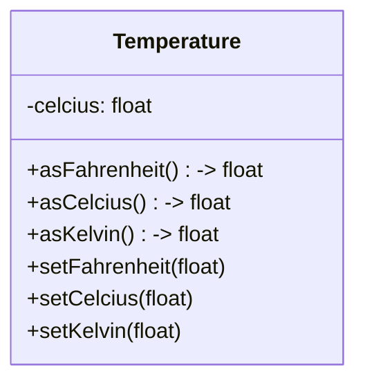

## Overview
We define a new data type *Temperature*

| | |
| --------- | --------------------------- |
| Exercise Folder | FirstClass |
| Builds On | None |
| Time to complete | 30 minutes

---

### Concepts

Earlier, we created functions that converted temperatures from one scale to another.  

We also created variables to hold temperatures in a particular scale.  A class, or *type* in general is the combination data and the functions that operate on that data.

Types can be complicated with many data fields and functions, or can be simple.  Let's start with a simple type.

In the class defined above, we have a single data field, *celcius* and a number of functions that operate on that data field.  The functions that operate on the data field are called *methods*.  We chose to use Celcius as the internal representation of the temperature, but we could have chosen any scale.  We could have chosen Fahrenheit, Kelvin, or even Rankine.  The choice of Celcius is arbitrary.

### Steps
* Create a new console application named *FirstClass*
* Right click on the project and select *Add* -> *New Item*
* Add a new header (.h) file named *Temperature.h*
* Define a new class named *Temperature* in the header file
* Wrap the class definition in **namespace utility::temperature**
   * Note- You will need to set the C++ Language Standard to C++17 (or higher) in the project properties
* Define a private data field named *celcius* of type *float*
* Define public methods to convert to and from Celcius, Fahrenheit, and Kelvin
   * *asCelcius()*
   * *asFahrenheit()*
   * *asKelvin()*
   * *setCelcius()*
   * *setFahrenheit()*
   * *setKelvin()*
* Use the formulas from the previous exercises to implement the methods.
* In *main*, create some temperature variables and print them out.
* Build and run the program
* Review the output and verify that the temperatures are correct

### Part 2
* Add a new source (.cpp) file named *Temperature.cpp*
* Copy the function *setFahrenheit()* from the class definition in *Temperature.h* to the new source file
* Change the function in the class to a declaration (remove the body)
* Add the namespace to the function declaration in the .cpp

