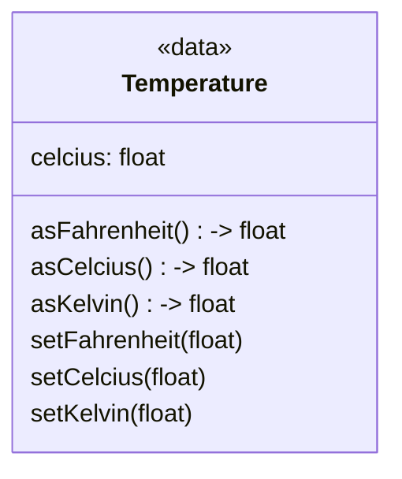

## Overview
We define a new data type *Temperature*

| | |
| --------- | --------------------------- |
| Exercise Folder | FirstClass |
| Builds On | None |
| Time to complete | 30 minutes

---

### Concepts

Earlier, we created functions that converted temperatures from one scale to another.  

We also created variables to hold temperatures in a particular scale.  A class, or *type* in general is the combination data and the functions that operate on that data.

Types can be complicated with many data fields and functions, or can be simple.  Let's start with a simple type.

